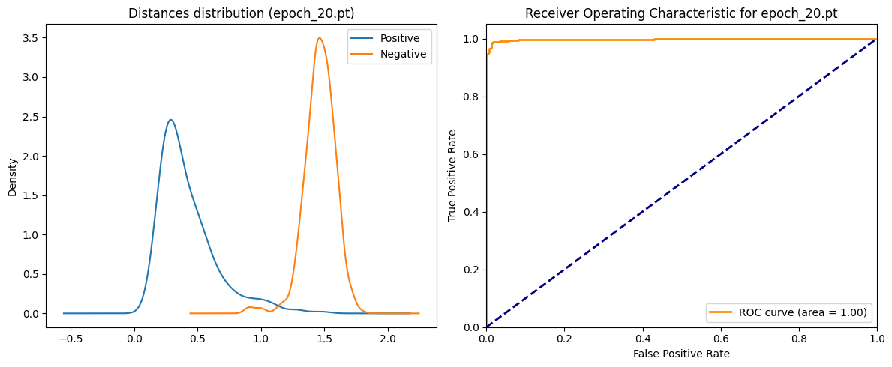
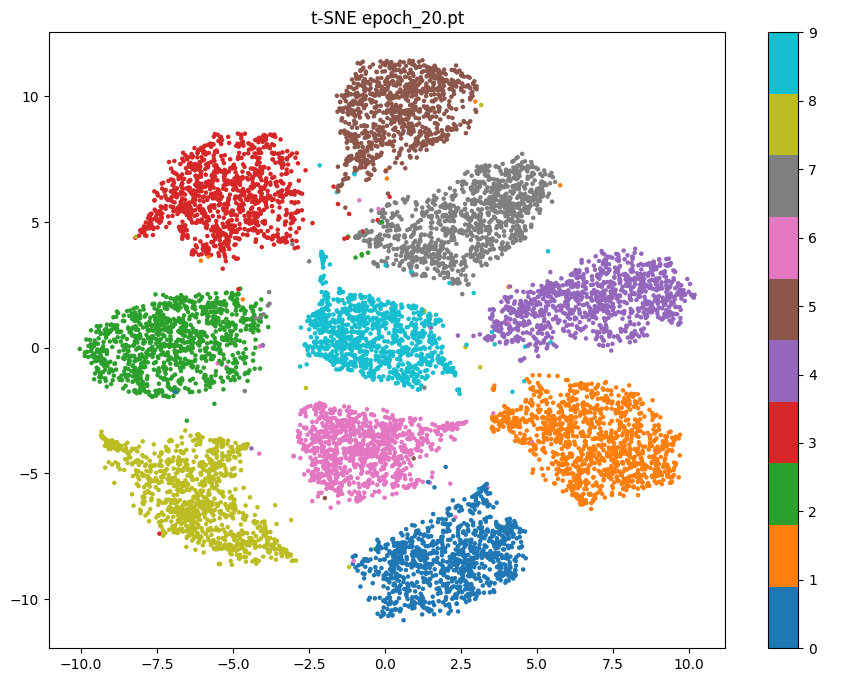

# **MNIST Triplet Loss**

| Metric | Value |
| :---: | :---: |
| Target FAR | 1e-03 |
| Threshold | 0.8916 |
| Accuracy | 0.9717 |
| VAL | 0.9434 |
| FAR | 0.0000 |
| Positive Mean | 0.4232 ± 0.2290 |
| Negative Mean | 1.4625 ± 0.1223 |

 

